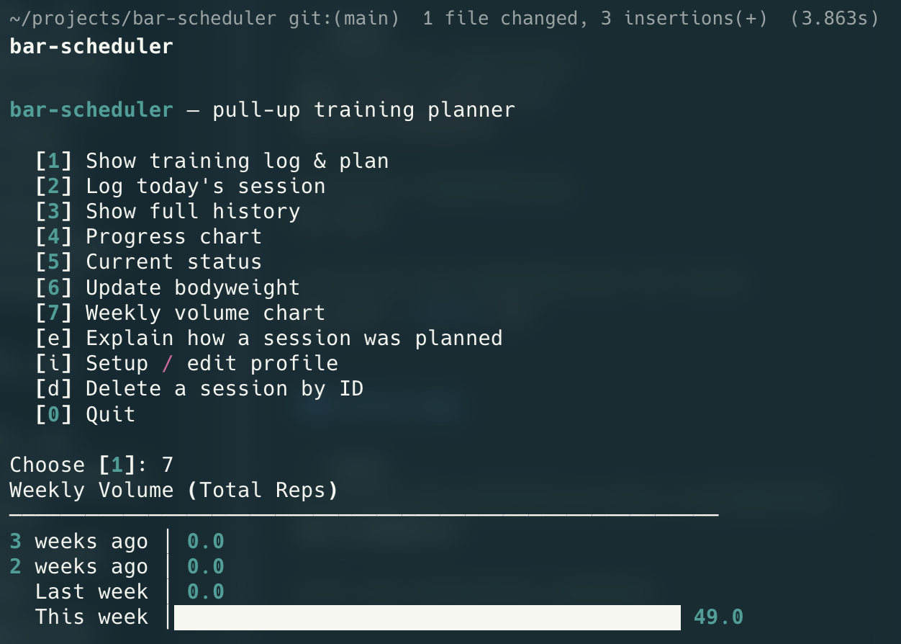

# bar-scheduler

Evidence-informed training planner for bodyweight strength exercises.
Supports **Pull-Up**, **Parallel Bar Dip**, and **Bulgarian Split Squat (DB)** — all sharing one planning engine.




## Quickstart

```bash
git clone <repo-url> && cd bar-scheduler
uv sync --extra dev       # install deps (dev includes test tools)
uv run bar-scheduler      # open interactive menu
```

**Global install** (no `uv run` prefix needed):
```bash
uv tool install -e .
```

## Commands

| Command | Description |
|---------|-------------|
| `profile init` | Create / update profile; requires `--height-cm`, `--sex`, `--bodyweight-kg` |
| `profile update-weight 85.5` | Update current bodyweight |
| `profile update-equipment` | Configure bands, machine, or BSS surface |
| `profile update-language ru` | Save display language to profile |
| `plan` | Unified history + upcoming plan table; `--weeks N`; `--json` |
| `refresh-plan` | Reset plan anchor to today after a break; `--json` |
| `log-session` | Log a completed session (one-liner or interactive) |
| `show-history` | Display training history; `--limit N`; `--json` |
| `plot-max` | ASCII chart of max reps; `-t z/g/m` trajectory overlays |
| `status` | Current TM, readiness, plateau/deload flags; `--json` |
| `volume` | Weekly rep volume chart; `--weeks N`; `--json` |
| `explain DATE\|next` | Step-by-step breakdown of how a session was planned |
| `1rm` | Estimate 1-rep max (5 formulas with ★ recommendation) |
| `delete-record N` | Delete history entry #N |
| `help-adaptation` | Adaptation timeline: what the model can predict at each stage |

All data commands accept `--exercise / -e` (default: `pull_up`). Add `--json` for machine-readable output.

## Interactive Menu

Run `bar-scheduler` without arguments:

```
[1] Show training log & plan
[2] Log today's session
[3] Show full history
[4] Progress chart
[5] Current status
[6] Update bodyweight
[7] Weekly volume chart
[e] Explain how a session was planned
[r] Estimate 1-rep max
[f] Reset plan to today (after a break)
[u] Update training equipment
[l] Change display language
[i] Setup / edit profile & training days
[d] Delete a session by ID
[a] How the planner adapts over time
[0] Quit
```

## Multi-Exercise & Language

```bash
bar-scheduler -e dip          # open menu with dip pre-selected
bar-scheduler -e bss plan     # run plan command for BSS
bar-scheduler --lang ru       # Russian interface for this session
bar-scheduler profile update-language zh   # save Chinese as default
```

Separate history files per exercise: `~/.bar-scheduler/pull_up_history.jsonl`, `dip_history.jsonl`, `bss_history.jsonl`.

Available languages (auto-discovered from `locales/*.yaml`): **en**, **ru**, **zh**.

## Documentation

- [CLI Examples](docs/cli_examples.md) — commands, sets format, output examples
- [JSON API](docs/api_info.md) — full JSON schemas for `--json` output
- [Training Model](docs/training_model.md) — adaptation logic summary (Russian)
- [Formula Reference](docs/formulas_reference.md) — all formulas with config knobs
- [Exercise Structure](docs/exercise-structure.md) — how to add a custom exercise
- [Plan Logic](docs/plan_logic.md) — technical reference: prescription stability, skip mechanism
- [Adaptation Guide](docs/adaptation_guide.md) — what to expect at each stage

## Running Tests

```bash
uv run pytest
```

## License

CC BY-NC 4.0 — non-commercial use with attribution. See [LICENSE](LICENSE).
